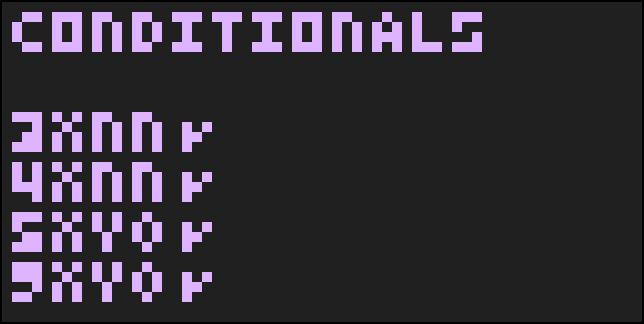
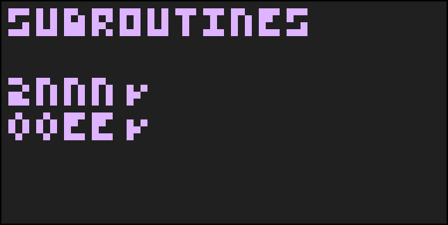
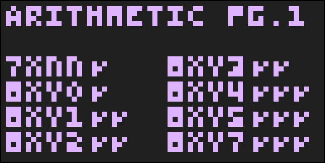
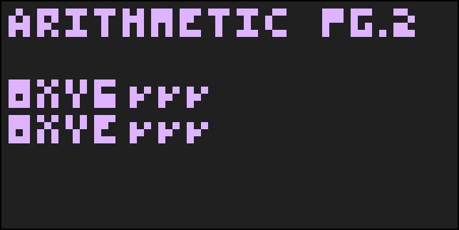

# Opcode Test Documentation

## Conditionals

`3xnn` - If register `x` is equal to `nn`, skip the next opcode.   
`4xnn` - If register `x` is not equal to `nn`, skip the next opcode.   
`5xy0` - If register `x` is equal to register `y`, skip the next opcode.   
`9xy0` - If register `x` is not equal to register `y`, skip the next opcode.   

### Failure Codes
`1` - Opcode always skips the next opcode.

## Subroutines

`2nnn` - Call a subroutine at the hex address `nnn`.   
`00ee` - Return from a subroutine.

## Arithmetic (Page 1)

`7xnn` - Add the hex value `nn` to register `x`.   
`8xy0` - Set register `x` to the value of register `y`.   

`8xy1` - Bitwise OR register `x` and register `y` together. Put the resulting value into register `x` and reset register 15.   
`8xy2` - Bitwise AND register `x` and register `y` together. Put the resulting value into register `x` and reset register 15.   
`8xy3` - Bitwise XOR/EOR register `x` and register `y` together. Put the resulting value into register `x` and reset register 15.   

`8xy4` - Add the values of register `x` and register `y` together. Put the resulting value into register `x`. Set register 15 to 1 if register `x` overflows over 255; otherwise, set the register to 0 even if `x` equals 15. 

### Failure Codes
`8xy1`, `8xy2`, `8xy3`:   
`1` - Opcode changes register 15 to a nonsensical value.   
`2` - Opcode resets register 15, and then stores the result into the same register.

`8xy4`:   
`1` - Register 15 is not set to 0 on a non-overflow operation.   
`2` - Register 15 is not set to 1 on an overflow operation.   
`3` - Register `x` is not an unsigned 8-bit integer.   
`4` - Register 15 is being overriden with the result of the operation as it is being used as register `x`. Use the order of `result -> flag` to fix this issue.   
`5` - Register 15 is being set too early, and is corrupting the resulting value in register `x`.

## Arithmetic (Page 2)

## Memory

## Other

`VIP` - Stricter group of tests that test for parity with the original Cosmac VIP.

The `VIP` test does four individual tests to determine parity with a VIP system.

Test 1 - Test for the VIP's monitor ROM at hex address $8000. (Checks that I does not wrap around $000 to $FFF)   
Test 2 - Test for the interpreter's framebuffer being at hex address $0F00 to $0FFF.   
Test 3 - Test for if the VIP's font data is stored at $8110 to $8142. (All bytes require parity with the original VIP font.)   
Test 4 - Test for parity of the Display Wait quirk of the original VIP. (The original VIP's quirk waited a variable 1-2 frames.)
