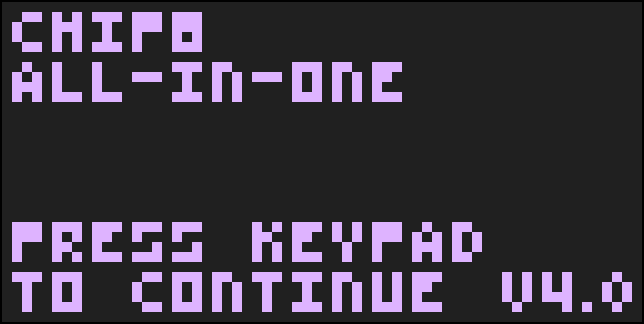

# Chip-8 All-In-One
This repo homes the Chip-8 All-In-One test ROM.

## Prerequisite
### Required Opcodes
This ROM requires certain opcodes to allow general function of the tests. This includes:
- `1NNN`
- `6XNN`
- `ANNN`
- `DXYN`
- `FX0A`

### Test Definitions
After running a test on an opcode, the test will return one of three possible outcomes.
- A tick mark, "✔": Test Passed
- A dash, "➖": Test Skipped
- A Number: Test Failed; visit the [Failure Code Document](Information/OpcodeFailures.MD) for definitions on each failure code.

## Opcode Tests
For more information, visit the [Opcode Test Document](Information/OpcodeTests.MD).

### Conditionals
- `3XNN`
- `4XNN`
- `5XY0`
- `9XY0`

### Subroutines
- `2NNN`
- `00EE`

### Arithmetic
- `8XY0`
- `8XY1`
- `8XY2`
- `8XY3`
- `8XY4`
- `8XY5`
- `8XY6`
- `8XY7`
- `8XYE`

### Memory
- `FX1E`
- `FX55`
- `FX65`

### Miscellaneous
- Out of Bounds (OOB) Test
- VIP Accuracy Test